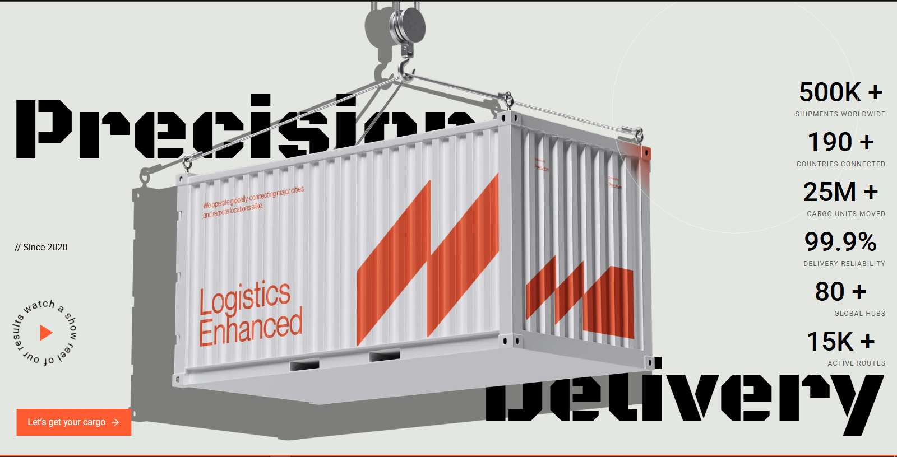

# Setby

Setby is a modern web application built with Next.js, React, and GSAP for animations, styled with Tailwind CSS.

## Demo

**Live Demo URL:** [https://setby.netlify.app/](https://setby.netlify.app/)



## Technology Stack

- **Framework:** Next.js
- **UI Library:** React
- **Animations:** GSAP (GreenSock Animation Platform)
- **Styling:** Tailwind CSS
- **Language:** TypeScript

## Getting Started

To run the development server locally, follow these steps:

1. Clone the repository and navigate into the project directory.
2. Install the dependencies:

```bash
pnpm install
```

3. Run the development server:

```bash
pnpm dev
```

4. Open [http://localhost:3000](http://localhost:3000) with your browser to see the result.

## Scripts

- `pnpm dev`: Starts the development server.
- `pnpm build`: Builds the application for production.
- `pnpm start`: Starts the production server.
- `pnpm lint`: Runs ESLint to check for linting errors.
- `pnpm format`: Formats code using Prettier.

## Code Quality Tools

- ESLint
- Prettier
- Husky
- lint-staged
